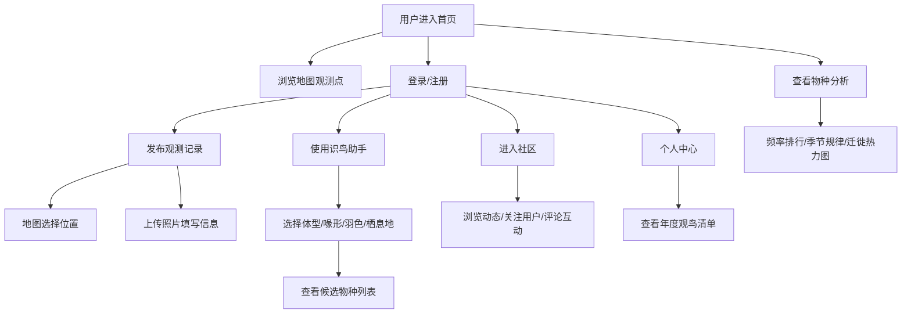

## 1. 产品概述

城市野鸟观测点地图与物种识别日志社区，是一款面向城市观鸟爱好者的综合平台。用户可在地图上标记观测位置，上传鸟类照片，通过多级特征筛选辅助识别鸟类，同时查看物种出现频率、季节性规律及迁徙热力图，并在社区中与其他观鸟者互动交流。

- 核心价值：降低观鸟入门门槛，建立城市野鸟观测数据库，促进观鸟爱好者社区的形成
- 目标用户：城市观鸟爱好者、自然教育工作者、生态摄影爱好者、公民科学家

## 2. 核心功能

### 2.1 用户角色

| 角色 | 注册方式 | 核心权限 |
|------|----------|----------|
| 观鸟用户 | 用户名注册 | 发布观测记录、识鸟筛选、评论关注、查看热力图、年度清单 |
| 游客 | 无需注册 | 浏览观测地图、查看公开观测记录、浏览物种数据 |

### 2.2 功能模块

1. **首页/地图页**：交互式地图展示观测点、筛选搜索、观测点详情弹窗
2. **观测日志发布**：地图选点、照片上传、填写观测信息（时间/天气/行为描述）
3. **识鸟助手**：基于体型、喙形、羽色、栖息地的多级筛选，候选物种列表
4. **物种分析页**：物种频率排名、季节性规律图表、迁徙热力图
5. **社区页**：观鸟者列表、关注功能、观测动态流
6. **用户个人页**：个人信息、年度观鸟清单、发布历史、关注与粉丝

### 2.3 页面详情

| 页面名称 | 模块名称 | 功能描述 |
|----------|----------|----------|
| 首页/地图页 | 顶部导航 | Logo、搜索框、导航菜单、用户头像 |
| 首页/地图页 | 交互式地图 | Leaflet地图、观测点标记、聚类展示、点击弹窗 |
| 首页/地图页 | 侧边筛选栏 | 按物种筛选、按时间筛选、按用户筛选 |
| 发布观测页 | 位置选择 | 地图选点、自动定位、搜索地点 |
| 发布观测页 | 信息表单 | 照片上传、物种选择/待定、观测时间、天气选择、行为描述 |
| 识鸟助手页 | 特征筛选器 | 体型选择、喙形选择、羽色多选项、栖息地选择 |
| 识鸟助手页 | 候选物种 | 匹配物种卡片、相似度、物种详情链接 |
| 物种分析页 | 频率排行榜 | 物种出现次数柱状图、TOP物种卡片 |
| 物种分析页 | 季节性规律 | 月度出现折线图、季节分布雷达图 |
| 物种分析页 | 迁徙热力图 | 地图热力图叠加、时间轴播放 |
| 社区页 | 用户动态流 | 最新观测记录卡片流、点赞评论按钮 |
| 社区页 | 观鸟者列表 | 用户卡片、关注/取消关注按钮 |
| 个人中心页 | 年度清单 | 年度观测物种日历、收集进度、新纪录标记 |
| 个人中心页 | 用户信息 | 头像昵称、个人简介、关注统计 |

## 3. 核心流程

用户打开应用后，可以浏览地图上的观测点，或登录后发布新的观测记录。发布时需在地图上选择位置，上传照片并填写详细信息。识鸟助手可帮助用户通过特征筛选匹配候选物种。系统会自动汇总所有数据生成热力图和统计分析。用户可在社区关注其他观鸟者，评论互动，建立个人年度观鸟清单。

## 4. 用户界面设计

### 4.1 设计风格

- 主色调：自然森林绿 `#2D6A4F`，辅以大地棕 `#52796F` 和天蓝色 `#89C2D9`
- 背景色：米白色渐变 `#F8F9FA` 到 `#E8F5E9`，营造自然舒适感
- 按钮风格：圆角 12px，悬浮微上浮阴影，平滑过渡动画
- 字体：标题使用 "Playfair Display" 衬线体，正文使用 "Noto Sans SC" 无衬线体
- 布局风格：卡片式布局 + 侧边栏 + 顶部导航，地图区域全屏展示
- 图标风格：Lucide 线性图标，搭配鸟类剪影装饰元素
- 整体美学：自然杂志风，强调照片和地图的视觉表现力

### 4.2 页面设计概述

| 页面名称 | 模块名称 | UI元素 |
|----------|----------|--------|
| 首页/地图页 | 地图区域 | 全屏Leaflet地图、自定义鸟类图标标记、聚类动画、弹窗卡片 |
| 首页/地图页 | 侧边筛选 | 折叠式面板、标签筛选、日期范围选择器 |
| 发布观测页 | 表单卡片 | 分步表单引导、地图定位器、拖放上传区、天气图标选择 |
| 识鸟助手页 | 筛选面板 | 胶囊选择器组、多色羽色标签、进度条、候选卡片滚动列表 |
| 物种分析页 | 可视化区 | ECharts图表、热力图时间滑块、图例开关、卡片网格 |
| 社区页 | 动态流 | 瀑布流卡片、时间轴、评论展开、头像悬停动效 |
| 个人中心页 | 年度清单 | 网格日历布局、物种徽章、收集进度圆环 |

### 4.3 响应式

- 桌面优先设计（1440px基准）
- 平板端（768px-1024px）：侧边栏折叠为抽屉，动态流改为2列
- 移动端（<768px）：底部Tab导航，地图全屏可切换，单列瀑布流
- 触摸优化：增大点击区域至44px，支持左右滑动切换卡片
