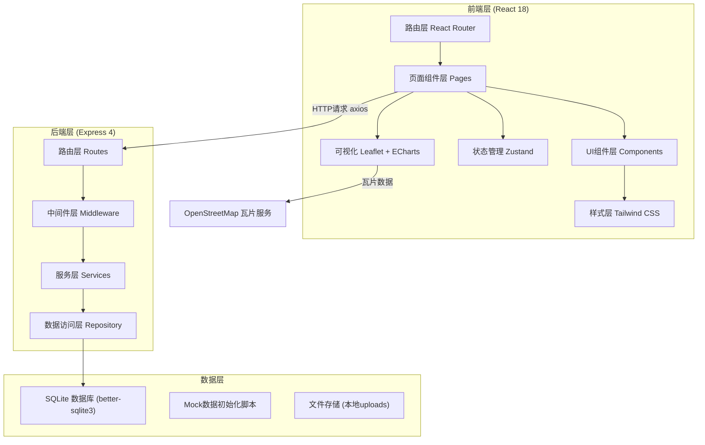
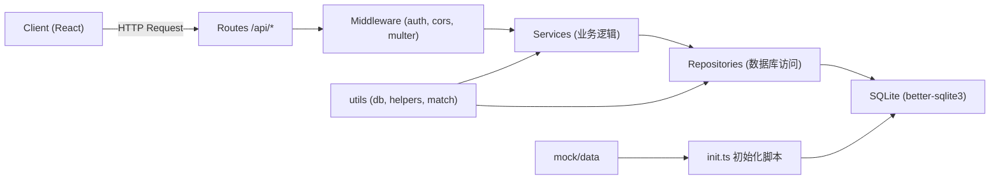

## 1. 架构设计



## 2. 技术描述

- 前端：React@18 + TypeScript@5 + Vite@5 + TailwindCSS@3 + Zustand@4
- 后端：Express@4 + TypeScript@5 + better-sqlite3
- 地图：leaflet@1.9 + react-leaflet@4 + leaflet.heat
- 图表：echarts@5 + echarts-for-react
- 图标：lucide-react
- HTTP：axios
- 项目初始化：vite-init 模板 react-express-ts
- 数据库：SQLite（文件存储，便于本地运行）

## 3. 路由定义

| 前端路由 | 页面组件 | 用途 |
|----------|----------|------|
| / | MapHomePage | 首页：交互式观测地图 |
| /observe/new | NewObservationPage | 发布新的观测记录 |
| /bird-id | BirdIdPage | 识鸟助手：多级特征筛选 |
| /analytics | AnalyticsPage | 物种分析：频率/季节/热力图 |
| /community | CommunityPage | 社区：动态流与观鸟者 |
| /profile/:userId | ProfilePage | 用户个人页与年度清单 |
| /observe/:id | ObservationDetailPage | 观测记录详情 |
| /species/:id | SpeciesDetailPage | 物种详情页 |
| /login | LoginPage | 用户登录 |

## 4. API 定义

### 4.1 观测记录 API
```typescript
// 类型定义
interface Observation {
  id: number;
  userId: number;
  speciesId: number | null;
  speciesName: string;
  latitude: number;
  longitude: number;
  locationName: string;
  observationTime: string;
  weather: string;
  behavior: string;
  photoUrls: string[];
  description: string;
  createdAt: string;
  likes: number;
  user: User;
  species: Species | null;
  comments: Comment[];
}

// GET /api/observations - 获取观测记录列表（支持筛选）
// Query: { speciesId?, userId?, startDate?, endDate?, lat?, lng?, radius? }
// Response: { data: Observation[], total: number }

// GET /api/observations/:id - 获取单条记录详情
// Response: { data: Observation }

// POST /api/observations - 创建观测记录
// Body: { speciesId, speciesName, latitude, longitude, locationName, 
//         observationTime, weather, behavior, photoUrls, description }
// Response: { data: Observation }

// POST /api/observations/:id/like - 点赞
// Response: { success: true, likes: number }
```

### 4.2 物种数据库 API
```typescript
interface Species {
  id: number;
  name: string;
  scientificName: string;
  size: 'small' | 'medium' | 'large' | 'xlarge';
  beakShape: 'short' | 'slender' | 'curved' | 'hooked' | 'conical';
  featherColors: string[];
  habitat: string[];
  description: string;
  imageUrl: string;
  rarity: number;
  migrationPattern: 'resident' | 'summer' | 'winter' | 'passage';
}

// GET /api/species - 获取物种列表（支持筛选）
// Query: { size?, beakShape?, featherColors?, habitat?, search? }
// Response: { data: Species[], total: number }

// GET /api/species/:id - 物种详情
// Response: { data: Species & { observations: Observation[] } }

// GET /api/species/match - 特征匹配（识鸟助手）
// Query: { size?, beakShape?, featherColors?, habitat? }
// Response: { data: (Species & { matchScore: number })[] }
```

### 4.3 统计分析 API
```typescript
// GET /api/analytics/frequency - 物种出现频率
// Query: { startDate?, endDate?, limit? }
// Response: { data: { speciesId, speciesName, count, imageUrl }[] }

// GET /api/analytics/seasonal - 季节性规律
// Query: { speciesId? }
// Response: { data: { month: number, count: number }[] }

// GET /api/analytics/heatmap - 迁徙热力图数据
// Query: { speciesId?, startDate?, endDate?, month? }
// Response: { data: [number, number, number][] }  // [lat, lng, count]
```

### 4.4 用户与社区 API
```typescript
interface User {
  id: number;
  username: string;
  avatar: string;
  bio: string;
  observationsCount: number;
  speciesCount: number;
  followersCount: number;
  followingCount: number;
  isFollowing?: boolean;
}

interface Comment {
  id: number;
  observationId: number;
  userId: number;
  content: string;
  createdAt: string;
  user: User;
}

// POST /api/auth/login - 登录
// Body: { username, password }
// Response: { token, user: User }

// GET /api/users/:id - 用户详情
// Response: { data: User & { observations: Observation[] } }

// GET /api/users/:id/yearlist - 年度观鸟清单
// Query: { year? }
// Response: { data: { speciesId, speciesName, count, firstDate, imageUrl }[], total: number }

// GET /api/users/following/:id - 关注列表
// POST /api/users/follow/:id - 关注用户
// DELETE /api/users/follow/:id - 取消关注

// GET /api/feed - 社区动态（关注用户的观测）
// Response: { data: Observation[] }

// POST /api/observations/:id/comments - 发表评论
// Body: { content }
// Response: { data: Comment }
```

## 5. 后端分层架构



## 6. 数据模型

### 6.1 ER 图

```mermaid
erDiagram
    USER {
        INTEGER id PK
        TEXT username UNIQUE
        TEXT password_hash
        TEXT avatar
        TEXT bio
        TEXT created_at
    }
    SPECIES {
        INTEGER id PK
        TEXT name
        TEXT scientific_name
        TEXT size
        TEXT beak_shape
        TEXT feather_colors
        TEXT habitat
        TEXT description
        TEXT image_url
        INTEGER rarity
        TEXT migration_pattern
    }
    OBSERVATION {
        INTEGER id PK
        INTEGER user_id FK
        INTEGER species_id FK
        TEXT species_name
        REAL latitude
        REAL longitude
        TEXT location_name
        TEXT observation_time
        TEXT weather
        TEXT behavior
        TEXT photo_urls
        TEXT description
        INTEGER likes DEFAULT 0
        TEXT created_at
    }
    COMMENT {
        INTEGER id PK
        INTEGER observation_id FK
        INTEGER user_id FK
        TEXT content
        TEXT created_at
    }
    FOLLOW {
        INTEGER id PK
        INTEGER follower_id FK
        INTEGER following_id FK
        TEXT created_at
    }
    LIKE_RECORD {
        INTEGER id PK
        INTEGER user_id FK
        INTEGER observation_id FK
        TEXT created_at
    }
    USER ||--o{ OBSERVATION : "发布"
    SPECIES ||--o{ OBSERVATION : "属于"
    OBSERVATION ||--o{ COMMENT : "包含"
    USER ||--o{ COMMENT : "发表"
    USER ||--o{ FOLLOW : "关注"
    FOLLOW }o--|| USER : "被关注"
    USER ||--o{ LIKE_RECORD : "点赞"
    LIKE_RECORD }o--|| OBSERVATION : "被点赞"
```

### 6.2 DDL 语句

```sql
CREATE TABLE IF NOT EXISTS users (
  id INTEGER PRIMARY KEY AUTOINCREMENT,
  username TEXT UNIQUE NOT NULL,
  password_hash TEXT NOT NULL,
  avatar TEXT DEFAULT '',
  bio TEXT DEFAULT '',
  created_at TEXT DEFAULT CURRENT_TIMESTAMP
);

CREATE TABLE IF NOT EXISTS species (
  id INTEGER PRIMARY KEY AUTOINCREMENT,
  name TEXT NOT NULL,
  scientific_name TEXT NOT NULL,
  size TEXT CHECK(size IN ('small','medium','large','xlarge')),
  beak_shape TEXT CHECK(beak_shape IN ('short','slender','curved','hooked','conical')),
  feather_colors TEXT NOT NULL,
  habitat TEXT NOT NULL,
  description TEXT DEFAULT '',
  image_url TEXT DEFAULT '',
  rarity INTEGER DEFAULT 50,
  migration_pattern TEXT CHECK(migration_pattern IN ('resident','summer','winter','passage')) DEFAULT 'resident'
);

CREATE TABLE IF NOT EXISTS observations (
  id INTEGER PRIMARY KEY AUTOINCREMENT,
  user_id INTEGER NOT NULL,
  species_id INTEGER,
  species_name TEXT NOT NULL,
  latitude REAL NOT NULL,
  longitude REAL NOT NULL,
  location_name TEXT,
  observation_time TEXT NOT NULL,
  weather TEXT,
  behavior TEXT,
  photo_urls TEXT DEFAULT '[]',
  description TEXT DEFAULT '',
  likes INTEGER DEFAULT 0,
  created_at TEXT DEFAULT CURRENT_TIMESTAMP,
  FOREIGN KEY (user_id) REFERENCES users(id),
  FOREIGN KEY (species_id) REFERENCES species(id)
);

CREATE TABLE IF NOT EXISTS comments (
  id INTEGER PRIMARY KEY AUTOINCREMENT,
  observation_id INTEGER NOT NULL,
  user_id INTEGER NOT NULL,
  content TEXT NOT NULL,
  created_at TEXT DEFAULT CURRENT_TIMESTAMP,
  FOREIGN KEY (observation_id) REFERENCES observations(id),
  FOREIGN KEY (user_id) REFERENCES users(id)
);

CREATE TABLE IF NOT EXISTS follows (
  id INTEGER PRIMARY KEY AUTOINCREMENT,
  follower_id INTEGER NOT NULL,
  following_id INTEGER NOT NULL,
  created_at TEXT DEFAULT CURRENT_TIMESTAMP,
  UNIQUE(follower_id, following_id),
  FOREIGN KEY (follower_id) REFERENCES users(id),
  FOREIGN KEY (following_id) REFERENCES users(id)
);

CREATE TABLE IF NOT EXISTS like_records (
  id INTEGER PRIMARY KEY AUTOINCREMENT,
  user_id INTEGER NOT NULL,
  observation_id INTEGER NOT NULL,
  created_at TEXT DEFAULT CURRENT_TIMESTAMP,
  UNIQUE(user_id, observation_id),
  FOREIGN KEY (user_id) REFERENCES users(id),
  FOREIGN KEY (observation_id) REFERENCES observations(id)
);

CREATE INDEX IF NOT EXISTS idx_obs_species ON observations(species_id);
CREATE INDEX IF NOT EXISTS idx_obs_time ON observations(observation_time);
CREATE INDEX IF NOT EXISTS idx_obs_location ON observations(latitude, longitude);
CREATE INDEX IF NOT EXISTS idx_comments_obs ON comments(observation_id);
```
